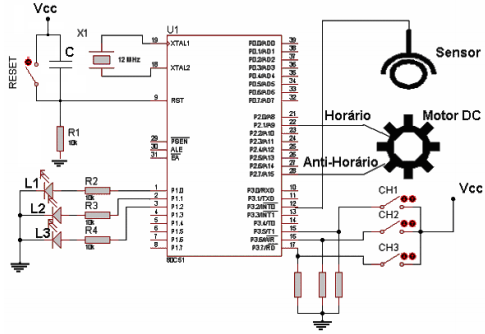

# Questions

## Part A

Escrever um programa em Assembly do 8051 que ao ligar qualquer das chaves ocorre o seguinte:

 * CH1(P3.5) fechada | pisca apenas o Led L1(P1.0) na freqüência de 1 Hz
 * CH2(P3.6) fechada | pisca apenas o Led L2(P1.1) na freqüência de 1 Hz
 * CH3(P3.7) fechada | pisca alternadamente o Led L3(P1.2) e o Led L1(P1.0) na freqüência de 1 Hz

Qualquer outra combinação das chaves não deve haver ação nos Leds.
O programa deve ficar em Loop para que a qualquer instante o operador possa alterar as opções das chaves.

## Part B

O Motor DC é ativado de acordo com a seguinte tabela:

<table>
    <tr>
        <td>P2.1</td>
        <td>P2.7</td>
        <td>Motor</td>
    </tr>
    <tr>
        <td>0</td>
        <td>0</td>
        <td>Parado</td>
    </tr>
    <tr>
        <td>0</td>
        <td>1</td>
        <td>Anti-Horário</td>
    </tr>
    <tr>
        <td>1</td>
        <td>0</td>
        <td>Horário</td>
    </tr>
    <tr>
        <td>1</td>
        <td>1</td>
        <td>Parado</td>
    </tr>
</table>

Escrever um programa em Assembly do 8051 que controle uma esteira transportadora da seguinte maneira:
1. Acionar o motor DC no sentido Horário.
2. Quando o produto passar pelo sensor, um sinal de Interrupção é enviado e a esteira é parada por 5 segundos para permitir a retirada do produto transportado.
3. Inverter o sentido do motor DC (Anti-horário).
4. Através de um mecanismo na esteira, uma nova interrupção é enviada pelo mesmo pino Int0 quando a esteira estiver reposicionada para aceitar outro produto.
5. Parar a esteira por 10 segundos e re-iniciar o processo.

